# Production-Grade Double-Entry Backend Ledger

A secure, high-concurrency double-entry ledger backend system built with **Node.js**, **Express**, and **MongoDB/Mongoose**. This engine is designed to handle financial transactions (credits/debits) between user accounts while maintaining strict consistency, immutability, and protection against double-spending under high concurrency.

---

## Key Engineering Features

1. **Double-Entry Accounting Core**: Accounts do not store a mutable balance field. Instead, balance is dynamically calculated by aggregating all historic debit and credit entries in the ledger. This ensures 100% auditability and consistent data.
2. **Strict Concurrency Protection (Locking)**: Uses pessimistic document-level write-locks on accounts inside MongoDB transaction sessions. This serializes concurrent requests for the same sender, eliminating race conditions and double-spending.
3. **Database Transaction Atomicity**: All multi-document operations (creating transaction records, debiting sender, crediting receiver, marking transactions completed) are executed within atomic MongoDB sessions. If any step fails, the entire transaction is rolled back.
4. **Ledger Immutability**: Protected by custom Mongoose hooks that intercept and block any queries attempting to update, delete, or replace ledger entries, ensuring that financial history cannot be altered.
5. **Idempotency Layer**: Incorporates a unique idempotency key validation on transfers to prevent duplicate requests from being processed in the case of network retries.
6. **JWT & Token Blacklisting**: Secure authentication middleware with token-blacklisting on logout using MongoDB TTL indices to automatically expire blacklisted tokens.
7. **Robust Validation**: Strict schema validation for all endpoint request bodies using **Zod**.
8. **Structured Logging**: Replaced standard logs with a structured **Winston** JSON logger, colorized for local development and ready for ingestion into production APMs (e.g., Datadog, ELK).

---

## System Architecture Flow

```mermaid
sequenceDiagram
    autonumber
    actor Client
    participant API as Express Router
    participant Validation as Zod Middleware
    participant Controller as Transaction Controller
    participant DB as MongoDB Transaction Session
    participant Email as Email Service (Async)

    Client->>API: POST /api/transactions (with Idempotency Key)
    API->>Validation: Validate request body schema
    Validation-->>API: Validated payload
    API->>Controller: Route to createTransaction()
    
    rect rgb(30, 30, 40)
        Note over Controller, DB: MongoDB Transaction Session
        Controller->>DB: Lock Sender Account (findOneAndUpdate)
        Controller->>DB: Fetch Recipient Account
        Controller->>DB: getBalance(session) (Evaluate Sender Balance)
        alt Balance < Transfer Amount
            DB-->>Controller: Abort & Rollback
            Controller-->>Client: 400 Insufficient Balance
        else Balance >= Transfer Amount
            Controller->>DB: Create Transaction (PENDING)
            Controller->>DB: Write DEBIT Ledger Entry
            Controller->>DB: Write CREDIT Ledger Entry
            Controller->>DB: Update Transaction (COMPLETED)
            Controller->>DB: Commit Transaction
        end
    end

    Controller->>Email: sendTransactionEmail() (Out-of-band)
    Controller-->>Client: 201 Transaction Completed Successfully
    Email-->>Client: Email Notification
```



---

## Tech Stack

*   **Runtime**: Node.js
*   **Web Framework**: Express
*   **Database**: MongoDB (Mongoose ORM)
*   **Validation**: Zod
*   **Logging**: Winston
*   **Testing**: Jest & Supertest
*   **Containerization**: Docker & Docker Compose
*   **API Docs**: Swagger (OpenAPI 3.0)

---

## Getting Started

### Option 1: Running with Docker (Recommended)
This launches the Node app and automatically configures a single-node MongoDB Replica Set (required for transactions):
```bash
docker compose up --build
```
Once the container starts:
*   Interactive Swagger Docs: **[http://localhost:3000/api-docs](http://localhost:3000/api-docs)**
*   Application Server: `http://localhost:3000`

### Option 2: Running Locally (Manual)
1. **Clone the Repository**:
   ```bash
   git clone https://github.com/yourusername/backend-ledger.git
   cd backend-ledger
   ```
2. **Install Dependencies**:
   ```bash
   npm install
   ```
3. **Configure Environment**:
   Copy `.env.example` to `.env` and fill in your connection details (Note: MongoDB must run as a replica set locally for transactions to work):
   ```bash
   cp .env.example .env
   ```
4. **Start the App**:
   ```bash
   npm run dev
   ```

---

## Testing

The test suite runs an in-memory replica set via `mongodb-memory-server` ensuring tests run independently of any local database configurations.

Run all unit/integration tests (including a concurrency race condition test):
```bash
npm test
```

---

## API Documentation Overview

Expose interactive docs at `/api-docs` using Swagger. Below are the primary endpoints:

### Authentication
*   `POST /api/auth/register` - Create a new user account.
*   `POST /api/auth/login` - Authenticate user and receive a JWT.
*   `POST /api/auth/logout` - Invalidate and blacklist the JWT.

### Accounts
*   `POST /api/accounts` - Create a new user account (INR/USD/etc.).
*   `GET /api/accounts` - Retrieve all accounts belonging to the user.
*   `GET /api/accounts/balance/:accountId` - Retrieve dynamic balance for an account.

### Transactions
*   `POST /api/transactions` - Process a secure peer-to-peer transfer between accounts.
*   `POST /api/transactions/system/initial-funds` - Seeding funds from system accounts (System user only).
*   `POST /api/transactions/:transactionId/reverse` - Reverse a completed transaction (debit recipient, credit sender).
